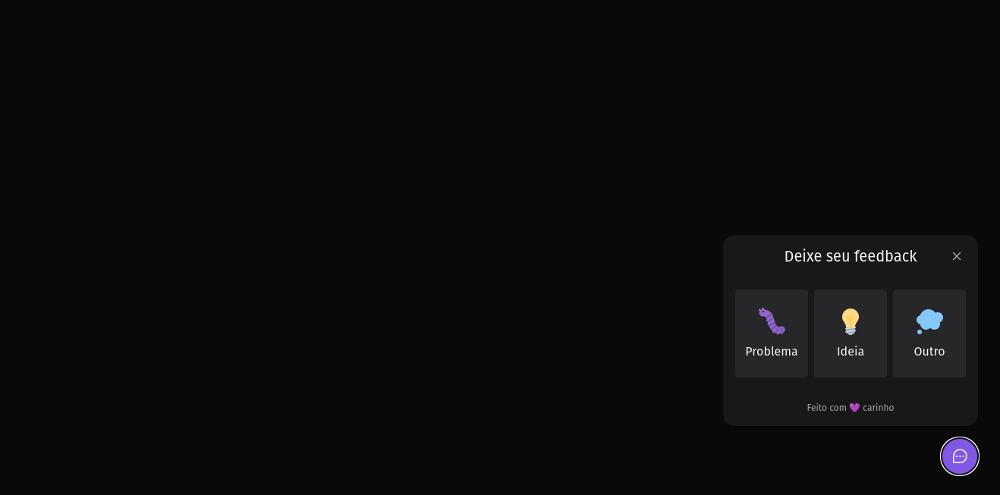
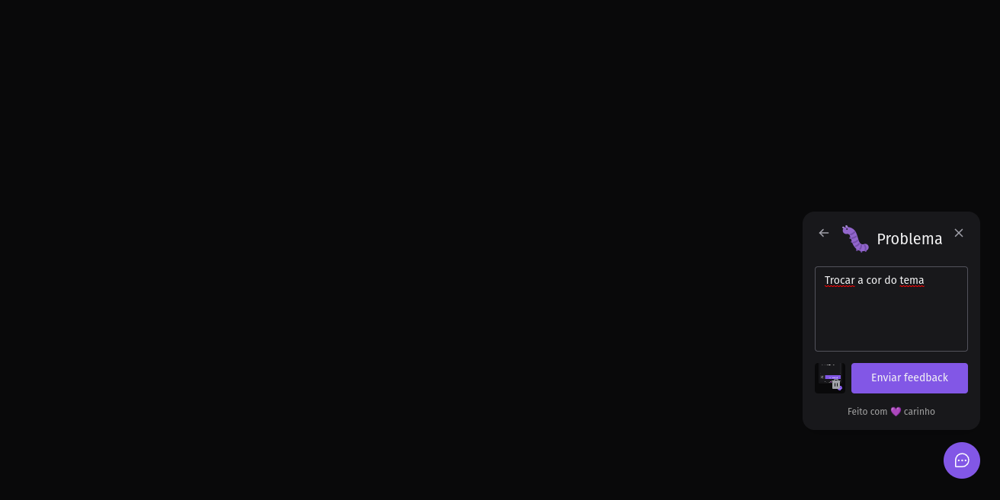

<h1 align="center">Feedget</h1>

# Feedget

App developed to collect feedback from your applications.
The project collects user feedback on issues,
gives suggestions for ideas, and more.

# Screens

<p align="left">

&nbsp; &nbsp;

&nbsp; &nbsp;

</p>

## Technologies used
  - [React](https://reactnative.dev)
  - [Vite](https://vitejs.dev/guide/)
  - [Tailwindcss](https://tailwindcss.com)
  - [Typescript](https://www.typescriptlang.org)

## Requirements

You need to install both [Node.js](https://nodejs.org) and [Yarn](https://yarnpkg.com) or npm to run this project.

## How to use it

```bash
  # Install the dependencies
  $ yarn install
  # Run app
  $ yarn dev
```

The app will be available for access on your browser at (http://localhost:3000)
